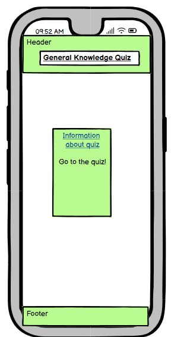
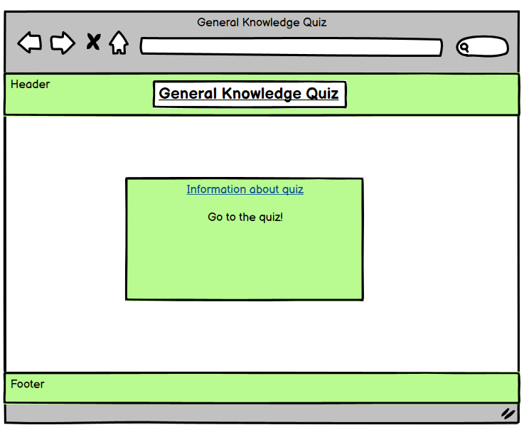
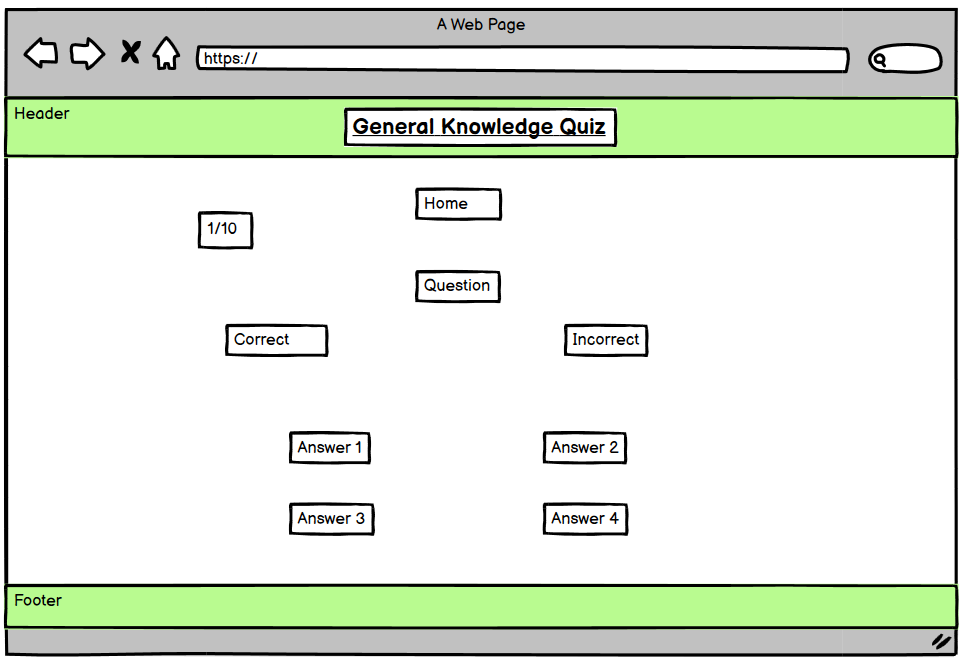

# Quiz

## User

- The website should be easily visible.

- The colors should not interfere with each other and make it difficult to see information and buttons.

- The information should be correct in order for people to potentially return to the website.

- The questions should be random which can allow a user to return and play the quiz again.

## Information Page

## Main Page

## Credits

- I had help with randomizing the questions inside the data element by watching this [Video]  (https://www.youtube.com/watch?v=rlYincT2Qzc)

- I have also used [Code Institute](https://codeinstitute.net/) to develop my knowledge of HTML, CSS and Javascript. It has also helped me learn new techniques I can implement into my code.

## Design

### Color

I have used a light green for the background color on the text because it is easy to look at and not conflicting with any other elements on the page.

White is also used with the majority of the page due to the fact that it is not an overwhelming color and will not be the main attraction of the pages.

The font color is black and this is because it is easy to read and very clear on the page. Another reason why I have chosen black to be the font color is because it does not clash with other colors.
## Technology Used

I have used a variety of software which has been vital in creating a successful website and these are:

- HTML was for the foundation of the website.
- CSS was for styling and to create an appropriate layout for the website.
- Javascript was needed to make the website reactive.
- VS Code was used to write the code.
- Git Hub held all the code used in the website.
- Balsamiq, I used this for planning the design of the website. 

## Wireframes

### Mobile Device

### Tablet Devices

### Desktop Devices

## Deployment

I deployed to the website Github where I was able to access all of my files with ease and to see the progression over time of how it built a quiz.

There are four files that contain the code that was able to create this website.

- home.html
- index.html
- style.css
- script.js

