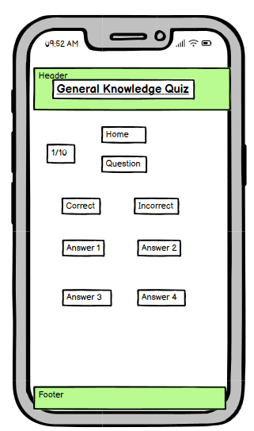

# Quiz

## User

- The website should be easily visible.

- The colors should not interfere with each other and make it difficult to see information and buttons.

- The information should be correct in order for people to potentially return to the website.

## Credits

- I had help with randomizing the questions inside the data element by watching this [Video]  (https://www.youtube.com/watch?v=rlYincT2Qzc)

## Design

### Fonts

### Color

I have used a light green for the background color on the text because it is easy to look at and not conflicting with any other elements on the page.

White is also used with the majority of the page due to the fact that it is not an overwhelming color and will not be the main attraction of the pages.

The font color is black and this is because it is easy to read and very clear on the page. Another reason why I have chosen black to be the font color is because it does not clash with other colors.
## Technology Used

- HTML
- CSS
- Javascript
- VS Code
- Git Hub

## Wireframes

### Mobile Device

### Tablet Devices

### Desktop Devices

## Deployment

I deployed to the website Github where I was able to access all of my files with ease and to see the progression over time of how it built a quiz.

There are four files that contain the code that was able to create this website.

- home.html
- index.html
- style.css
- script.js

