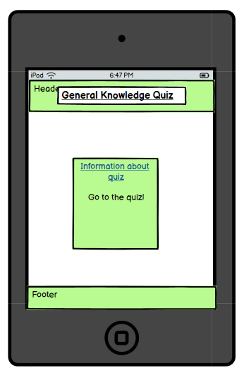
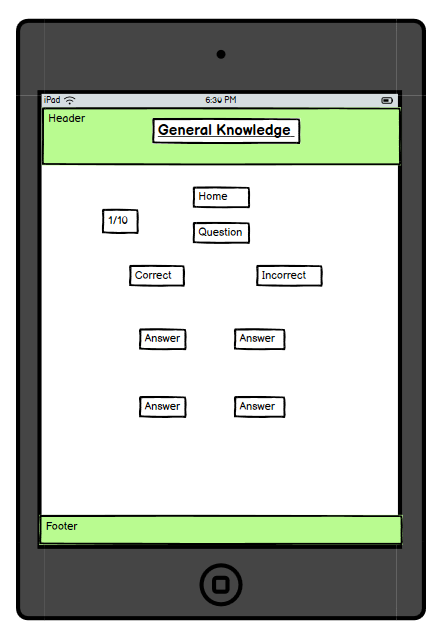

# Quiz

## User

### First Time User

- The website should be easily visible so first-time users would get drawn to play the quiz

- The colors should not interfere with each other and make it difficult to see information and buttons.

- When you open the web page it goes straight to the quiz so that it looks appealing.

- There is an information page that lets a user know what the web page is about.

### Returning User

- The information should be correct for people to potentially return to the website.

- The questions should be random which can allow a user to return and play the quiz again.

- The overall layout of the page should not be overwhelming so that someone does not want to return to the page.

### Frequent User

- The quiz should be knowledgeable so that people can partake in the quiz regularly so that they can learn different facts.

- The questions should be a wide variety of topics for it to be the best it can be. 

## Features

### Information Page

The information page is there to show the basics of how the quiz operates.

It also contains a link to the main page which is easily accessible.


### Main Page

I have called this the main page because it is going to be where the majority of the time spent on the website will be.

It contains a link to the information page which is easily visible.


I incorporated an alert message when there is an incorrect answer. It will appear at the top of the screen to ensure that the user knows it was false. 


In this image, the question shows that when an answer is clicked the rest of the answers are disabled which makes it so it can not pick more than one answer.

It also shows that when a question is answered correctly the scores are updated accurately


After the quiz is completed it will display how many questions you got correct and how many incorrect.


### Header

The header shows the title and is made to stand out and clearly show the user what the website is about.


### Footer

The footer contains a credits link which will take you to this [Github](https://github.com/oscarbutler/Quiz) repository.


## Credits

- I had help with randomizing the questions inside the data element by watching this [Video](https://www.youtube.com/watch?v=rlYincT2Qzc)

- I have also used [Code Institute](https://codeinstitute.net/) to develop my knowledge of HTML, CSS and Javascript. It has also helped me learn new techniques I can implement into my code.

The screenshots I took of my project I made using the "Snip and Sketch" application.

## Media

I got my favicons from the website [Icons8](https://icons8.com/icons).

## Bugs

### Solved

The question would not randomise so I looked at videos and replaced the code from a video from the credit section with this code ```data.sort(() => Math.random() - 0.5);```.

The question counter would go over the limit so I added the code which would make it so it was not displayed once the quiz was completed. I did this by adding this code to the show question function ```document.getElementById('question-number').style.visibility = 'hidden';```.

### Unsolved

There are no unsolved bugs.

### Mistakes

The git commit ab1c72f the description is "space between the buttons". This should have been "Add space between the buttons" because it is specific and explains if it is adding space or removing it.

## Design

### Color


I have used a light green for the background color on the text because it is easy to look at and not conflicting with any other elements on the page.

White is also used with the majority of the page due to the fact that it is not an overwhelming color and will not be the main attraction of the pages.

The font color is black and this is because it is easy to read and very clear on the page. Another reason why I have chosen black to be the font color is because it does not clash with other colors.

## Testing

Please look at [TESTING.md](TESTING.md) file.

## Technology Used

I have used a variety of software which has been vital in creating a successful website and these are:

- HTML was for the foundation of the website.
- CSS was for styling and to create an appropriate layout for the website.
- Javascript was needed to make the website reactive.
- VS Code was used to write the code.
- Git Hub held all the code used in the website.
- Balsamiq, I used this for planning the design of the website. 


## Wireframes

### Mobile Device


### Tablet Devices




### Desktop Devices


## Deployment

I deployed to the website Github where I was able to access all of my files with ease and to see the progression over time of how it built a quiz.

The link to the Github repository is [here](https://github.com/oscarbutler/Quiz)

The link to a live page is [here](https://oscarbutler.github.io/Quiz/index.html)

