# Testing

## Compatability

I will be choosing three different browsers and these are Opera, Google Chrome and Microsoft Edge.

This webpage is compatible with a variety of browsers and this is shown throughout these images because there are not any differences within the three browsers.

### Opera

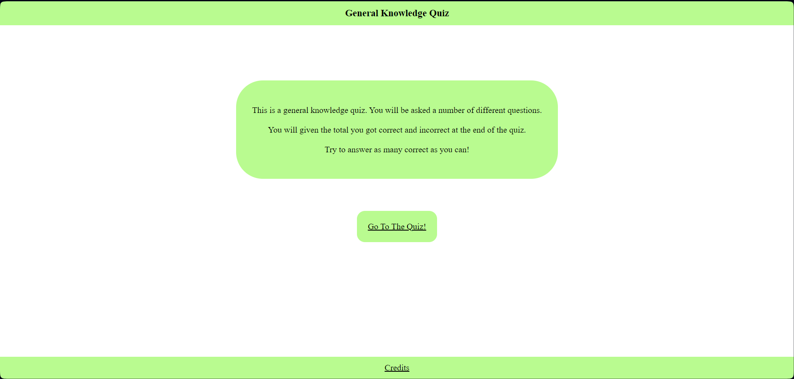

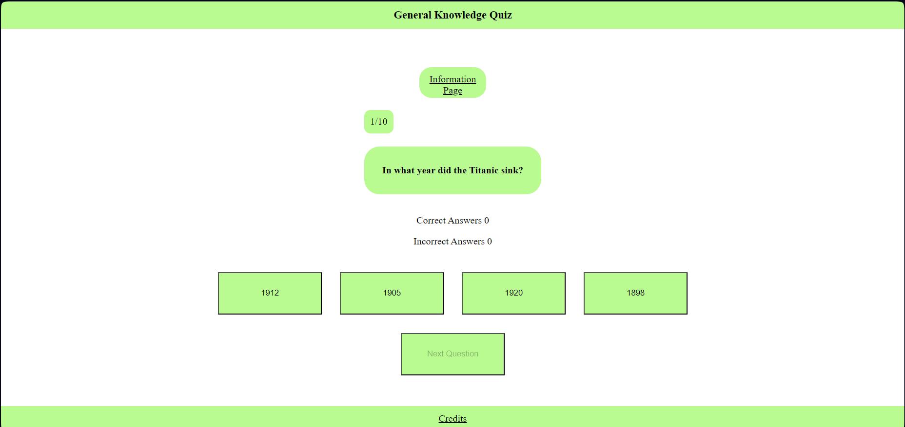

### Google Chrome

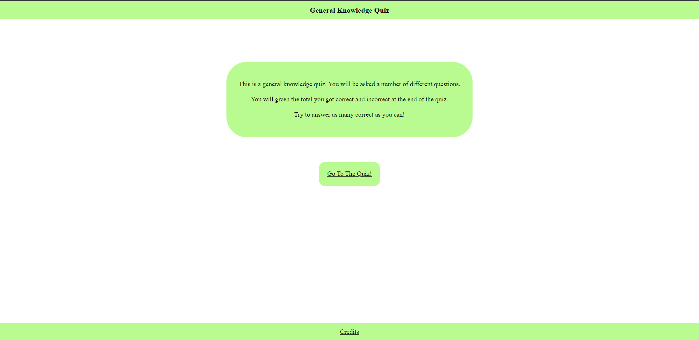

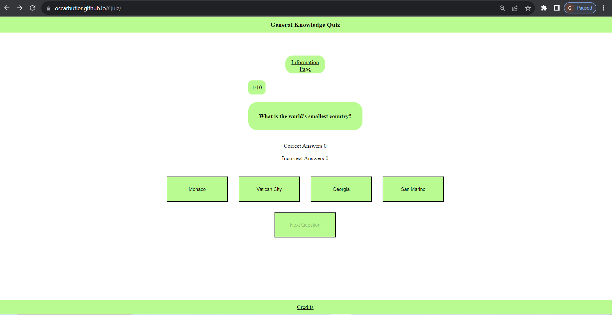

### Microsoft Edge

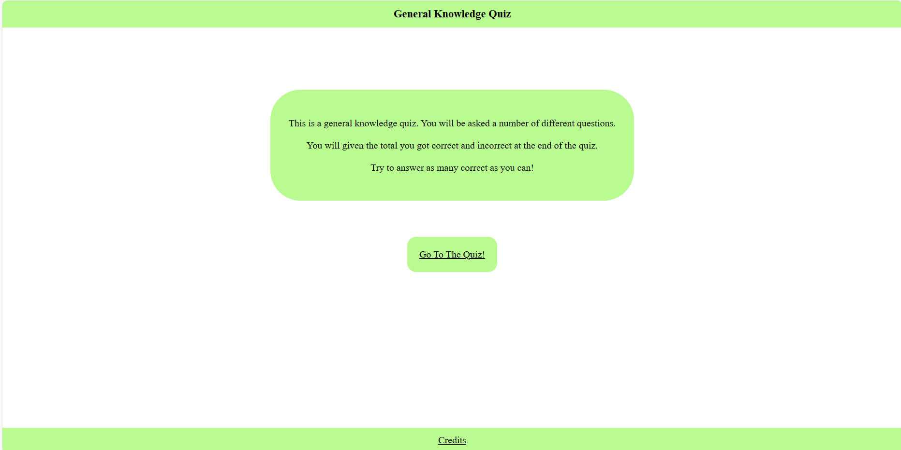

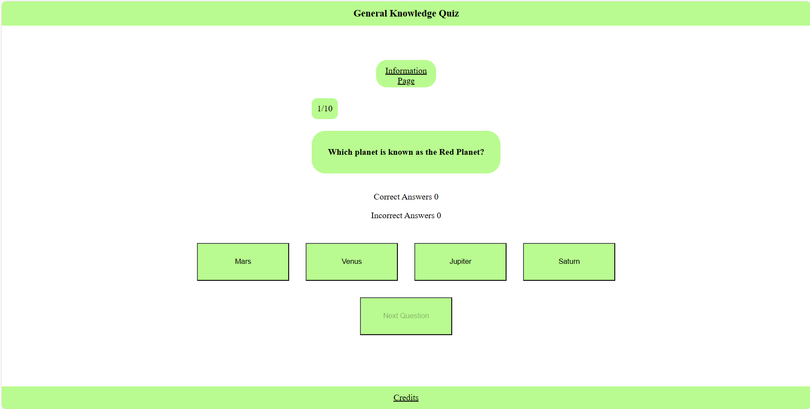

## Responsive Checker

In order to check how responsive the web pages are I used [responsive viewer](https://chromewebstore.google.com/detail/responsive-viewer/inmopeiepgfljkpkidclfgbgbmfcennb)

### Information Page

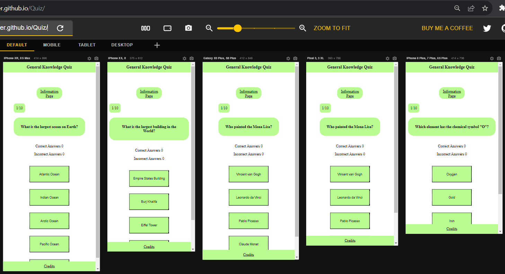

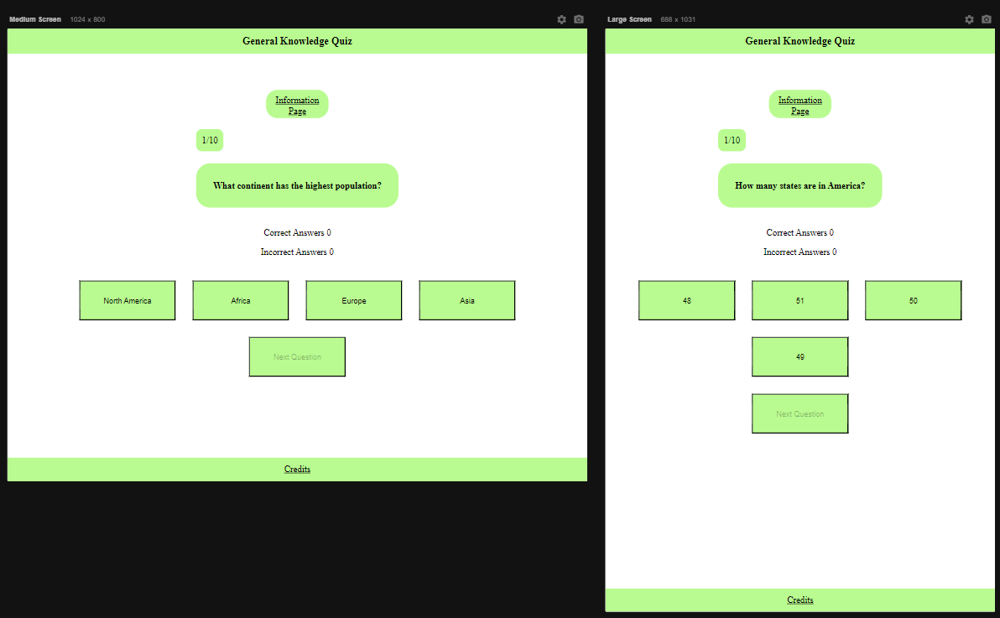

### Main Page

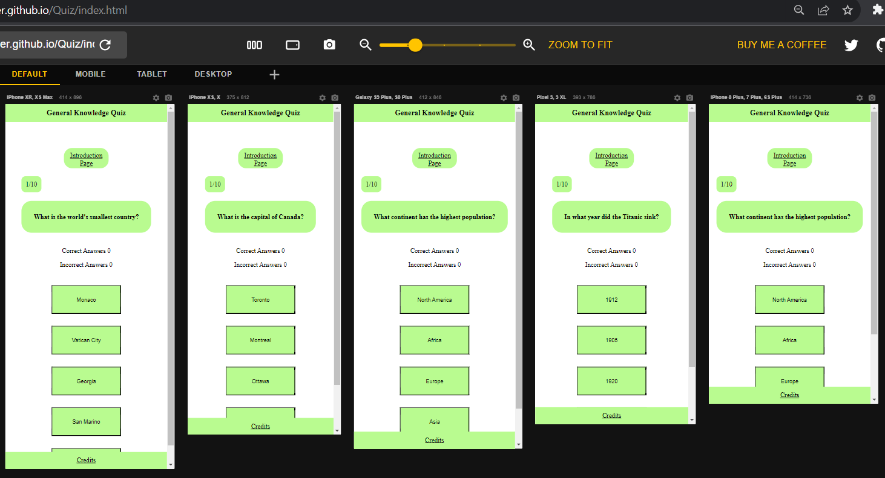

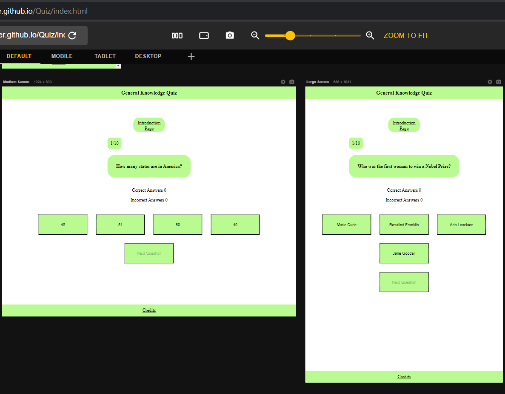

## Manual Testing

| feature | action | expected result | tested | passed | comments |
| --- | --- | --- | --- | --- | --- |
| Go to the quiz link| Click on the "Go To The Quiz!" link | The user is redirected to the question page | Yes | Yes | - |
| Infomation Page button | Click on the "Infomation Page" link | The user is redirected to the infomation page | Yes | Yes | - |
| Clicking an answer | Click on the answers given | The answer should either add 1 to correct or incorrect | Yes | Yes | - |
| Next Question button | Click on the next question button | The user should see a random question with appropriate answers | Yes | Yes | - |
| Answer buttons | Click on one of the answer buttons | The user should see an error message if the answer is incorrect. It should also add an extra score to either incorrect or correct answer. | Yes | Yes | - |
| Incorrect alert | The alert if answer is incorrect | The user should recieve a alert saying "This is incorrect, try again!." | Yes | Yes | - |
| Question Number | The question number when going to next question | The question number should go up by one and dissapear at the end | Yes | Yes | - |
| Credits link | Click on credits link | It should open another tab that shows a Github account | Yes | Yes | - |

## Lighthouse

In order to check the how the successful the webpages are I used the lighthouse report in the devtools.

### Introduction Page

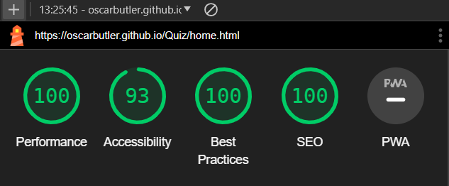

### Main Page

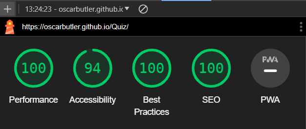

## HTML Check

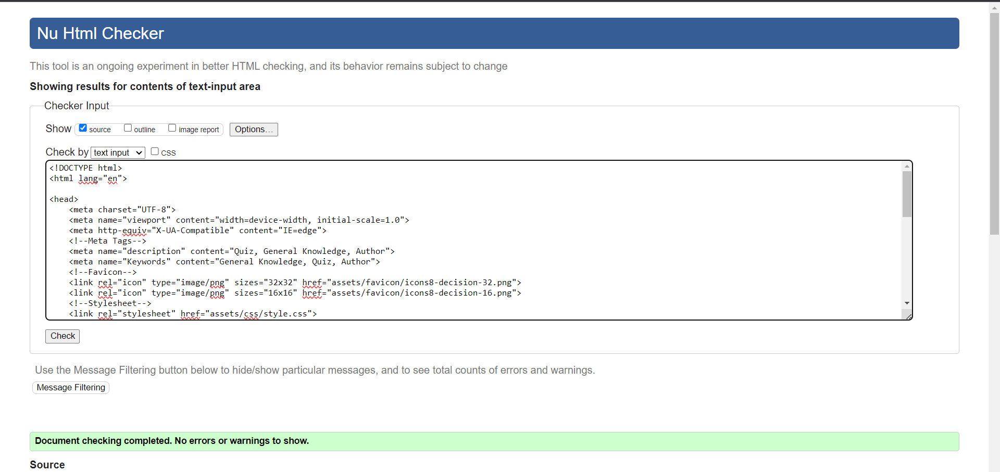

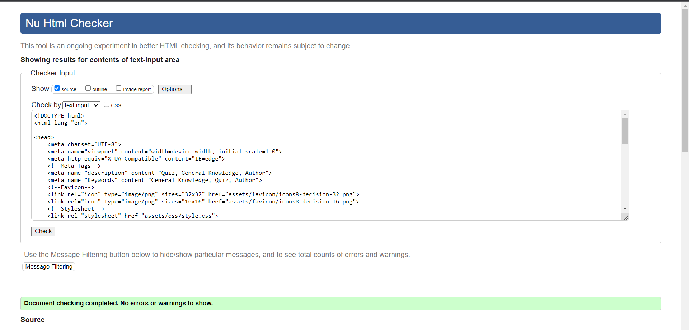

## CSS Checker

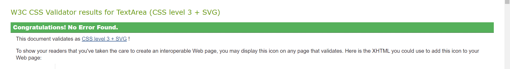